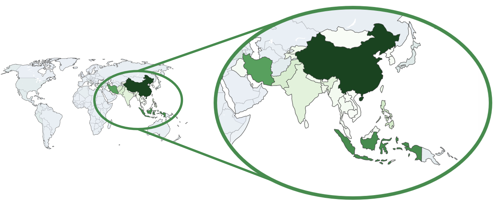

[Abstract](#abstract)  
[What data?](#what_data?)  
[Natural disasters in the world](#natural_disasters_in_the_world?)  
[Methods](#methods)  

2. [Results](#results)
  - [Map of natural disasters](#map_of_natural_disasters)
  - [Analysis of speakers](#analysis_of_speakers)
3. [Conclusion](#conclusion)

## Abstract 

Natural disasters, such as earthquakes, hurricanes, floods and wildfires, occur every year causing a lot of damage. Over the years, there has been a growing concern on the extent of climate change and on the potential impact it has on our current environment. The theories on the origin and on the nature of climate change have been flowing, there is still a lot of uncertainty on what to expect with it, but a shifting in the frequency and in the areas impacted by natural disasters has already been observed.

Every year, natural disasters impact the lives of thousands of people across the world, and as the main cause of many disruptions in the world, it is fair to expect the impact of these unfortunate events to spread to the media and the press. This story aims to depict how quotations taken from the news are able to reflect the natural events that have taken place and impacted the real world, and in a reverse manner, how the impact of natural disasters can be observed in the media.  

###  What data?

The QuoteBank dataset consists of millions of quotations found in online articles. Our analyses will be based on using these numerous quotes as an indicator of the overall media coverage of an event, thanks to their large number and to their diversity. It is possible to extract quotes relevant to the subject of natural disasters by selecting the ones citing specific words from a curated dictionary of diverse catastrophes. Along with the help of two datasets containing ground truth information on different kind of natural disasters [worldwide](https://www.emdat.be/), and most specifically [in the US](https://www.kaggle.com/headsortails/us-natural-disaster-declarations), we can try to see what parallels can be drawn between real data about natural disasters and quotes related to them.  

The quotes being in English, most of the quotations are most likely to be driven towards US-related material and events or towards events that have made such an impact that it is worth mentioning in the english or american news. The US natural disaster dataset allows us to have a more precise idea of where specifically in the US the unfortunate events took place, as it encodes county-wise information about the disasters.  

World map :

<iframe src="figures/slider_disasters.html" style="width: 100%; height: 100%; text-align: center; background-color: transparent; border: 0px none transparent; padding: 0px;"></iframe>Distribution of natural disasters per type
 

Looking at the earthquake distribution across the globe, we see that there seems to be an area that is particularly prone to experiencing earthquakes. If we zoom in, we see that the whole area including China, Iran, Indonesia and the Philippines has been subject to many earthquakes in recent times.  

ZOOMED IN PICTURE  

<!---
TO ADD THE INTERACTIVE PLOT
-->

<iframe src="figures/left_map.html" style="width: 100%; height: 100%; text-align: center; background-color: transparent; border: 0px none transparent; padding: 0px;"></iframe>Map of the number of hurricanes across the US
 

<!---
margin-left: auto; margin-right: auto;
-->

#### Exploration

With a quick look at the frequency of natural disasters key words in the quotations, one can observe peaks that most likely indicate the crisis.  

  
   

These can be easily verified with the ground truth dataset.  
Note that with some inspection, one can notice that some quotes contain natural disaster key words, but in other contexts like comparisons or hyperboles (E.g. Fire, storm, earthquake, ...). Here is another example for Wildfires cases.  

  

Furthermore, the location of the disaster can also be found in those quotes either by looking for states or cities inside the quotations or by comparing the dates of the frequency peaks with the ground truth dataset of natural crises and extracting the location. Here is an example for hurricanes.  

  

Unsurprisingly, quotes that talk about hurricanes also frequently mention Florida and Texas.  
Hence there is enough data to start constructing a spatial and temporal map of natural disasters.  

MAYBE ADD SOMETHING FOR SPEAKERS?

### Methods
Quick summary of what was done for maps + analysis of speakers (? maybe not necessary)

## Results
(--- move methods here ?)

###  Map of natural disasters
Map + explanation 

###  Analysis of speakers
TODO

<iframe src="figures/lda_res_pol.html" style="width: 100%; height: 100%; object-fit: contain; text-align: center; background-color: transparent; border: 0px none transparent; padding: 0px;"></iframe>Topic detection of quotes
 

## Conclusion
blabla

