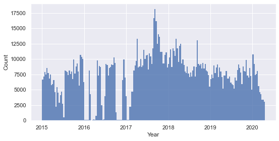
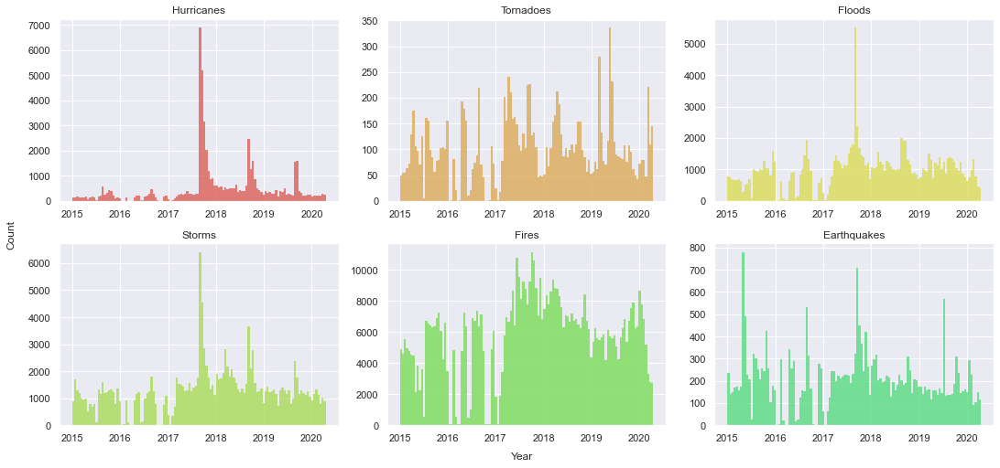
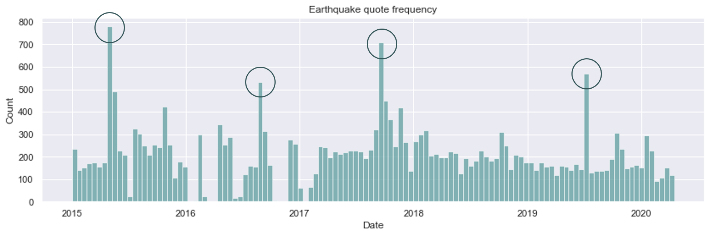
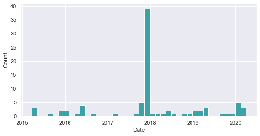
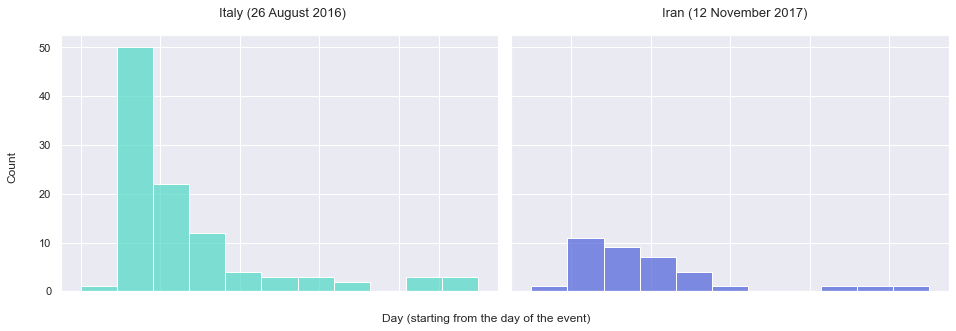
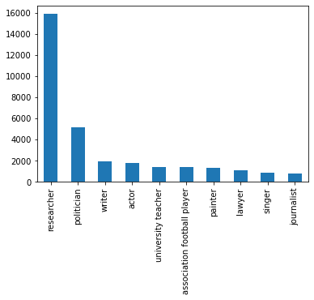
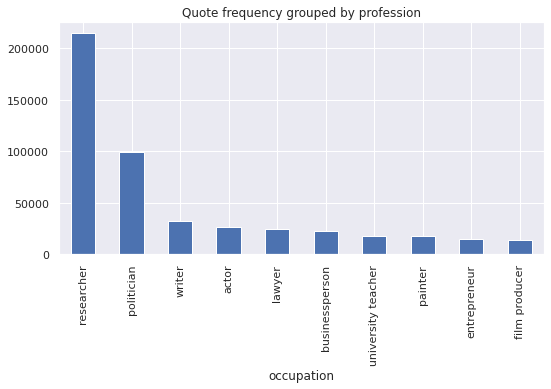
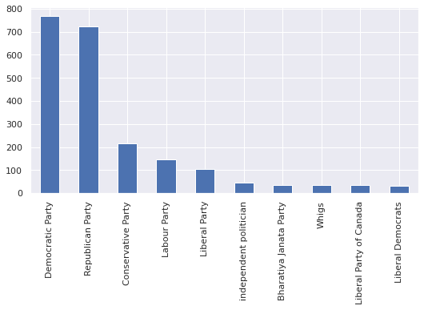

[Abstract](#abstract)  
[What data?](#what_data?)  
[Filtered quotes](#filtered_quotes)  
[Natural disasters in the world](#natural_disasters_in_the_world)  
[Earthquakes: case study](#earthquakes_case_study)  
[Natural disasters in the US](#natural_disasters_in_the_us)  
[Analysis of speakers](#analysis_of_speakers)  
[Topic detection](#topic_detection)  
[Conclusion](#conclusion)
  

##  Abstract 

Natural disasters, such as earthquakes, hurricanes, floods and wildfires, occur every year causing a lot of damage. Over the years, there has been a growing concern on the extent of climate change and on the potential impact it has on our current environment. The theories on the origin and on the nature of climate change have been flowing, there is still a lot of uncertainty on what to expect with it, but a shifting in the frequency and in the areas impacted by natural disasters has already been observed.

Every year, natural disasters impact the lives of thousands of people across the world, and as the main cause of many disruptions in the world, it is fair to expect the impact of these unfortunate events to spread to the media and the press. This story aims to depict how quotations taken from the news are able to reflect the natural events that have taken place and impacted the real world, and in a reverse manner, how the impact of natural disasters can be observed in the media.  

##  What data?

The QuoteBank dataset consists of millions of quotations found in online articles. Our analyses will be based on using these numerous quotes as an indicator of the overall media coverage of an event, thanks to their large number and to their diversity. It is possible to extract quotes relevant to the subject of natural disasters by selecting the ones citing specific words from a curated dictionary of diverse catastrophes. Along with the help of two datasets containing ground truth information on different kind of natural disasters <a href="https://www.emdat.be/">worldwide</a>, and most specifically <a href="https://www.kaggle.com/headsortails/us-natural-disaster-declarations">in the US</a>, we can try to see what parallels can be drawn between real data about natural disasters and quotes related to them.  

The quotes being in English, most of the quotations are most likely to be driven towards US-related material and events or towards events that have made such an impact that it is worth mentioning in the english or american news. The US natural disaster dataset allows us to have a more precise idea of where specifically in the US the unfortunate events took place, as it encodes county-wise information about the disasters.  

###  Filtered quotes

To specifically target quotes that are relevant to the subject of natural disasters, only the quotes containing words part of a list of words relevant to the subject are kept, such as 'hurricane', 'earthquake', 'fire', and so on. The time distribution of the filtered quotes is shown below :

 Distribution of the filtered quotes over time

The filtered quotes make up for a total of around 1'500'000 quotes, leaving us with a high number of quotes to work with. The frequency of the quotes is overall uniform despite a few drops, meaning that we can draw consistent comparisons if we compare the frequency of occurence of certain types of quotes in different period of times.

On the other hand, the separate distributions in time of each natural disaster of interest show very irregular and spiky shapes for most of them (figure below). These spikes in frequency mean that there are short periods of time which resulted in a use of the disaster name in the quotes that is far higher than usual. These already suggest that there was increased attention driven towards each natural disaster, already encoding some temporal information about the occurence of each natural disaster in the world or in the United States.

 Specific distribution of the quotes over time for each natural disaster type of interest

##  Natural disasters in the world

First getting an insight of how natural disasters affect the world in various ways depending on the area can help us with understanding what quotes to target in order to extract interesting facts from them. Feel free to slide between the different distributions of natural disasters in the world to get a better idea of the pattern with which these unfortunate events strike different areas of the world. The darker the country, the more times it has been struck by an event of the type defined by the slider. Note that data on the natural disasters occuring in countries such as the US are more likely to be reported due to the stronger influence of the american media on an international level as compared to other, smaller countries. This explains why the US are displayed as heavily impacted by most of those disasters and justifies why later focus on the US natural disaster dataset makes sense. 

<iframe src="figures/slider_disasters.html" style="width: 100%; height: 100%; background-color: transparent; border: 0px none transparent; padding: 0px;"></iframe>Distribution of reported natural disasters per type
 

###  Earthquakes: case study

Looking at the earthquake distribution across the globe, we see that there seems to be an area that is particularly prone to experiencing earthquakes. If we zoom in, we see that the whole area including China, Iran and Indonesia has been subject to many earthquakes in recent times. This map encodes information about the frequency distribution of earthquakes but does not display which earthquakes were the largest or the deadliest. We can expect an extraordinary earthquake to have an impact that translates into more quotes being aimed towards them. If we detect the highest peaks (on the figure below), retrieve their dates and location and find the corresponding earthquakes, we get that the earthquakes that triggered the biggest reactions are the following :
<ul>
  <li>Nepal (April 2015)</li>
  <li>Italy (August 2016)</li>
  <li>Mexico (September 2017)</li>
  <li>California (July 2019)</li>
</ul>
 

Frequency of quotes related to earthquakes with highlighted highest peaks

This standing is solely based on their impact on the quotations and not on whether they actually had a dramatic impact or not. As depicted on the world map above, Iran is a country that is being recurrently struck by earthquakes. If we plot the distribution of quotes that are at both relevant to earthquakes and Iran (available from 2015 to 2020 only, as opposed to the natural disaster dataset), we see that there's a notable peak in 2017, corresponding to a major earthquake that occured close to Iraq in <a href="https://reliefweb.int/disaster/eq-2017-000165-irn">Iran</a>, injuring around 10'000 people. <figure style="text-align: center; display: inline-block; float: right; margin: 0px 0px 12px 15px; max-width: 55%"><figcaption>Frequency of quotes related to earthquakes in Iran</figcaption></figure>
It does not make sense to compare those numbers with the ones from Nepal (significantly deadlier) and the ones from Mexico or California as it is part or related to the US, therefore more covered in the news. However, if we compare those to the earthquake that occured in <a href="https://en.wikipedia.org/wiki/August_2016_Central_Italy_earthquake">Italy</a> in 2016, the impact of the latter is significantly lower, with 400 people injured in the process.

If we now compare the impact the two events had in the news, using a plot of the quotes frequency at the moment of the event and for a duration of 11 days (until it stops being reported), we see that surprisingly the amount of quotes related to the italian disaster are significantly higher, as hinted by the peak previously detected in the earthquake distribution. Interestingly, these quotes suggest that the media coverage of the Iranian disaster is lower and fades faster, despite the event causing a lot more damage. Considering the long-lasting tense relationship between the US and Iran, we could expect that for two events that have no apparent link with the US, the one occuring in Iran is less likely to be reported by the news, as US news make up for a significant part of the quote dataset.

Comparison between the occurence of quotes related to each event, each bin represents a day

##  Natural disasters in the US

<ul>
  <li>Distribution of natural disasters in the US => map with slider</li>
  <li>Wildfires : case study</li>
  <li>Hurricanes : case study, hurricane seasonality observable in the quotes</li>
  <li>Comparison between spatial information retained in the quotes with factual data</li>
</ul>

<!---
TO ADD THE INTERACTIVE PLOT
-->

<iframe src="figures/left_map.html" style="width: 100%; height: 100%; text-align: center; background-color: transparent; border: 0px none transparent; padding: 0px;"></iframe>Map of the number of hurricanes across the US
 

<!---

Map Test 18

<iframe width="1250px" height="860px" src="figures/lda_res_pol.html" style="-webkit-transform:scale(0.65);-moz-transform-scale(0.65); position: absolute; top: -9999px; bottom: -9999px; left: -9999px; right: -9999px; margin: auto;"></iframe>

  

  <iframe src="figures/lda_res_pol.html" allowfullscreen></iframe>

  
  

  NEW TEST 6

    <iframe src="figures/lda_res_pol.html"></iframe>

<iframe style="width: 100%; height: 100%; -webkit-transform: scale(0.7); -moz-transform: scale(0.7);" src="figures/lda_res_pol.html" ></iframe>Topic detection of quotes where the speaker is a politician or a researcher

-->
<!---

<iframe style="width: 100%; height: 100%; -webkit-transform: scale(0.6); -moz-transform: scale(0.6); -webkit-transform-origin: top left;" src="figures/lda_res_pol.html" ></iframe>Topic detection of quotes where the speaker is a politician or a researcher

-->

#### Exploration

With a quick look at the frequency of natural disasters key words in the quotations, one can observe peaks that most likely indicate the crisis.  

  
   

These can be easily verified with the ground truth dataset.  
Note that with some inspection, one can notice that some quotes contain natural disaster key words, but in other contexts like comparisons or hyperboles (E.g. Fire, storm, earthquake, ...). Here is another example for Wildfires cases.  

  

Furthermore, the location of the disaster can also be found in those quotes either by looking for states or cities inside the quotations or by comparing the dates of the frequency peaks with the ground truth dataset of natural crises and extracting the location. Here is an example for hurricanes.  

  

Unsurprisingly, quotes that talk about hurricanes also frequently mention Florida and Texas.  
Hence there is enough data to start constructing a spatial and temporal map of natural disasters.  

##  Analysis of speakers

Now, let us investigate the speakers. What are their professions? For the politicians, what are their political affiliations? In the following graph we have plotted the distribution of the ten most common professions among the speakers in our list. Since we suspected that politicians may speak much more often than other groups we also plotted the distribution of quotes per profession.

We see that among the top ten groups, politicians speak slightly more often, but this increase is small enough that we can pretend that every unique speaker gives approximately the same number of quotes.
We see that the most frequent speakers are researchers followed by politicians. The rest of the occupations trail behind, having roughly the same frequency each.

<!-- TODO Maybe remove this bit -->

In the following graph we have plotted the distribution of the ten most common political affiliations among our speakers.

The parties that appear most often are those that operate in english-speaking countries. This is unsurprising given that we work with english quotes.

[Later in the article](#### Researcher vs Politicians: How does the way they speak differ ?), we will perform a bag-of-words logistic regression to differentiate researcher quotes with politician quotes.
Having found a good fit, in [the section after it](#### Topic Detection) we will display the result of a latent Dirichlet analysis (LDA), in the hopes of detecting what are the two main topics each group is talking about.

###  Researcher vs Politicians: How does the way they speak differ ?
We decide to turn our attention to the vocabulary used by politicians and researchers. How do they approach tragic events such as natural disasters?
We have created a model that is capable of identifying whether a certain quote is being spoken by a politician or a researcher with a high degree of certainty (greater than 99.5%). We found that the most indicative words for the two groups were the following.

| P | Q | P * Q |
| - | - | - |
| T | T | T |
| T | F | F |
| F | T | F |
| F | F | F |
{: .tablelines}

###  Topic Detection
<a href="figures/lda_res_pol.html">*See the LDA on a standalone page*</a>

<iframe src="figures/lda_res_pol.html" style="width: 100%; height: 100%; object-fit: contain; text-align: center; background-color: transparent; border: 0px none transparent; padding: 0px; margin-left: 0px" frameborder='0' ></iframe>Topic detection of quotes where the speaker is a politician or a researcher
 

  

##  Conclusion
blabla
